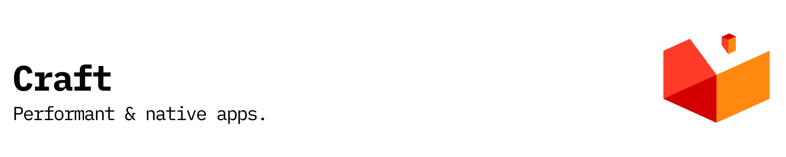

<p align="center"></p>

[![npm version][npm-version-src]][npm-version-href]
[![GitHub Actions][github-actions-src]][github-actions-href]
[](http://commitizen.github.io/cz-cli/)
<!-- [![npm downloads][npm-downloads-src]][npm-downloads-href] -->
<!-- [![Codecov][codecov-src]][codecov-href] -->

# Craft

Craft is a lightweight, high-performance cross-platform application framework. Create native apps that work on macOS, Linux, Windows, iOS, and Android with web technologies - all with a tiny ~297KB binary and blazing fast ~168ms startup time.

## Features

### 🌍 Platform Support

- 🖥️ **Desktop** - macOS, Linux, Windows
- 📱 **Mobile** - iOS _(WKWebView, UIKit)_ and Android _(WebView, Activity)_
- 🪟 **Menubar Apps** - Native system tray/menubar integration
- ⚡ **Native Performance** - ~168ms startup, <1% CPU idle, ~86MB memory
- 🪶 **Tiny Binary** - ~297KB binary size _(1351x smaller than Electron)_
- 🔧 **Zig-Powered** - Built with Zig for maximum performance

### 📱 Mobile Platform Support

- **iOS Integration**
  - WKWebView with JavaScript bridge
  - UIKit native components
  - Haptic feedback _(light, medium, heavy, selection, success, warning, error)_
  - Device permissions _(camera, location, notifications, photos, contacts, microphone)_
  - Orientation support _(portrait, landscape)_
  - Status bar control
  - App lifecycle management

- **Android Integration**
  - WebView with JavaScript interface
  - Activity lifecycle
  - Permissions system
  - Vibration and haptic feedback
  - File access and storage
  - Material Design support

### 🎨 Native Components Library (35 Total)

**Input Components**

- Button, TextInput, Checkbox, RadioButton
- Slider (with snapping, labels, percentage), ColorPicker (RGB/HSL/Hex), DatePicker, TimePicker
- Autocomplete (fuzzy search, keyboard nav)

**Display Components**

- Label, ImageView, ProgressBar, Spinner
- Avatar, Badge, Chip, Card
- Tooltip (8 positions, 6 themes), Toast (notifications)

**Layout Components**

- ScrollView, SplitView, Accordion, Stepper
- Modal, Tabs, Dropdown

**Data Components**

- ListView, Table, TreeView, DataGrid
- Chart (line, bar, pie)

**Navigation Components**

- TabView, Menu, Toolbar, StatusBar

**Advanced Components**

- Rating (star ratings with half-star support)
- CodeEditor (syntax highlighting)
- MediaPlayer (video/audio)

### 🪟 Menubar Applications

Build native menubar/system tray apps with full platform support:

**Features**

- Native system tray icons
- Custom menus with shortcuts
- Tooltip support
- Click handlers (left, right, double, middle)
- Window attachment for popover-style UIs
- Notifications integration

**Platform Implementations**

- macOS: NSStatusBar integration
- Linux: AppIndicator/StatusNotifier
- Windows: System tray via Shell_NotifyIcon

### 🎮 Advanced GPU Rendering

**Rendering Pipeline**

- Multi-backend support (Vulkan, Metal, Direct3D)
- Shader management (vertex, fragment, compute)
- Buffer management (vertex, index, uniform, storage)
- Texture and render target support
- Mesh rendering with vertex data

**Effects & Post-Processing**

- 10 built-in effects: Bloom, Blur, Sharpen, Vignette
- Chromatic Aberration, Film Grain, Color Grading
- Tone Mapping, Anti-Aliasing, Ambient Occlusion

**Advanced Features**

- Compute shader support
- Ray tracing with acceleration structures
- Multi-GPU support
- GPU profiling and performance monitoring

### 🖥️ System Integration

**Notifications**

- Native OS notifications
- Custom titles, bodies, icons
- Action buttons
- Urgency levels (low, normal, critical)
- Click callbacks

**Clipboard**

- Text read/write
- Image support
- File paths
- Watch for changes

**File Dialogs**

- Open file/multiple files
- Save file
- Select directory
- Custom file type filters
- Default paths

**System Info**

- OS name and version
- CPU information
- Memory stats (total, available, used)
- System uptime

**Power Management**

- Battery status and level
- Charging state
- Prevent/allow sleep
- Power state monitoring

**Screen Management**

- Multi-monitor support
- Screen resolution and scaling
- Primary screen detection
- Screen positioning

**URL Handling**

- Open URLs in default browser
- Register custom URL schemes
- Deep linking support

### 🛠️ Developer Experience

- 📟 **Powerful CLI** - 20+ command-line flags for quick prototyping
- 🔍 **DevTools** - Built-in WebKit DevTools (right-click > Inspect Element)
- 🎨 **Custom Styles** - Frameless, transparent, always-on-top windows
- 🌉 **JavaScript Bridge** - Seamless communication between JS and native code
- ⚙️ **Configuration** - TOML-based config files
- 📊 **Logging** - Structured logging system
- 🔥 **Hot Reload** - File watching with state preservation (scroll, forms, focus, custom state)
- 🎯 **Error Handling** - Context-aware errors with stack traces, metadata, recovery strategies
- 📈 **Performance Monitoring** - Built-in benchmarking suite, memory tracking, FPS monitoring
- 🐛 **Enhanced Debugging** - Beautiful error overlays, color-coded output, actionable suggestions

### 🪟 Window Management

- 📏 **Position Control** - Precise window positioning (x, y)
- 🖥️ **Fullscreen** - Native fullscreen mode
- 🔄 **State Management** - Minimize, maximize, close, hide, show
- ↔️ **Resize Control** - Custom resize behavior
- 🪟 **Multi-Window** - Multiple window support
- 🖥️ **Multi-Monitor** - Multi-monitor awareness

### 🎯 Advanced Features

- 📡 **Advanced IPC** - Message passing, channels, RPC, shared memory
- 🖌️ **Native Rendering** - Canvas API, pixel manipulation
- ⌨️ **Enhanced Shortcuts** - 90+ key codes with modifiers
- ♿ **Accessibility** - WCAG 2.1 AAA compliance with 40+ ARIA roles
  - Focus management with trap support
  - Keyboard navigation system (Tab, Arrow, Home, End keys)
  - Screen reader announcements (4 priority levels)
  - Contrast ratio checker (validates AA/AAA standards)
  - Semantic HTML mapping
  - 69 comprehensive accessibility tests
- 🌓 **Advanced Theming** - Nord, Dracula, Gruvbox, custom themes
- 💨 **Performance** - LRU caching, object pooling, lazy loading, memoization
- 📊 **Monitoring** - Built-in performance profiling and benchmarking
  - Statistical analysis (mean, median, std dev, ops/sec)
  - Memory allocation tracking
  - JSON and text report generation

### ✨ Async & State

- 🔄 **Async/Await** - Non-blocking I/O, streaming, promises, channels
- 🧩 **WebAssembly** - WASM plugin system with sandboxing
- 🎬 **Animations** - 31 easing functions, keyframes, springs
- 🔄 **State Management** - Reactive state with observers, undo/redo

### 🏢 Enterprise Ready

- 🔌 **Plugin System** - Dynamic library loading with marketplace
- 🛡️ **Sandbox** - 7 permission types for security
- 🌐 **i18n** - Internationalization with RTL support
- 🔐 **Code Signing** - macOS, Windows, Linux
- 📦 **Installers** - DMG, PKG, MSI, DEB, RPM, AppImage
- 🔄 **Auto-Updater** - Built-in update mechanism
- 📸 **Screen Capture** - Screenshots and recording
- 🖨️ **Print Support** - Native printing
- 📥 **Downloads** - Download management
- 🔌 **WebSocket** - Real-time communication
- 🔗 **Custom Protocols** - Register custom URL handlers (craft://)
- 🎯 **Drag & Drop** - File drag and drop support

## Quick Start

The fastest way to get started is with `create-craft`:

```bash
# Create a new Craft app
bun create craft my-app

# Navigate to your app
cd my-app

# Start development
bun run dev
```

Choose from multiple templates:

- **minimal** - Simplest possible app
- **full-featured** - Modern styled app with examples
- **todo-app** - Interactive todo list

```bash
# Use a specific template
bun create craft my-app --template full-featured
```

**See [create-craft documentation](./packages/create-craft/README.md) for all options.**

### Try the Examples

Explore ready-to-run examples in the `examples/` directory:

```bash
# Simple system tray app
bun run examples/simple-tray.ts

# Full-featured system tray app
bun run examples/system-tray-app.ts

# Pomodoro timer with live menubar updates (recommended!)
bun run examples/pomodoro.ts

# Alternative Pomodoro timer
bun run examples/menubar-timer.ts
```

**See [examples documentation](./examples/README.md) for more details.**

## Get Started

### TypeScript/JavaScript (Recommended)

Build desktop apps with TypeScript - zero dependencies, just pure Node.js APIs:

```bash
# Install the TypeScript SDK
bun add ts-craft
```

```typescript
// app.ts
import { show } from '@stacksjs/ts-craft'

const html = `
<!DOCTYPE html>
<html>
<head>
  <style>
    body {
      margin: 0;
      display: flex;
      justify-content: center;
      align-items: center;
      height: 100vh;
      background: linear-gradient(135deg, #667eea 0%, #764ba2 100%);
      color: white;
      font-family: system-ui;
    }
  </style>
</head>
<body>
  <h1>⚡ My First Craft App</h1>
</body>
</html>
`

// That's it! One line to show your desktop app
await show(html, { title: 'My App', width: 800, height: 600 })
```

```bash
# Run it
bun run app.ts
```

**See [TypeScript SDK Documentation](./packages/ts-craft/README.md) for the full API.**

### Zig (Advanced)

For advanced use cases where you need maximum performance and control:

```bash
# Install via npm
npm install -g ts-craft

# Or with Bun
bun add -g ts-craft
```

### Build from Source

```bash
# Clone the repository
git clone https://github.com/stacksjs/craft.git
cd craft

# Install Zig 0.15.1
# macOS
brew install zig

# Linux
wget https://ziglang.org/download/0.15.1/zig-linux-x86_64-0.15.1.tar.xz
tar -xf zig-linux-x86_64-0.15.1.tar.xz

# Build
zig build

# Run
./zig-out/bin/craft http://localhost:3000
```

### Platform-Specific Dependencies

**Linux:**

```bash
sudo apt-get install -y libgtk-3-dev libwebkit2gtk-4.1-dev
```

**Windows:**

```powershell
winget install Microsoft.EdgeWebView2Runtime
```

## Usage Examples

### Desktop Application

```zig
const std = @import("std");
const craft = @import("craft");

pub fn main() !void {
    var gpa = std.heap.GeneralPurposeAllocator(.{}){};
    defer _ = gpa.deinit();
    const allocator = gpa.allocator();

    var app = craft.App.init(allocator);
    defer app.deinit();

    _ = try app.createWindowWithURL(
        "My App",
        1200,
        800,
        "http://localhost:3000",
        .{
            .dark_mode = true,
            .hot_reload = true,
        },
    );

    try app.run();
}
```

### Menubar Application

```zig
const menubar = @import("menubar.zig");

pub fn main() !void {
    var gpa = std.heap.GeneralPurposeAllocator(.{}){};
    const allocator = gpa.allocator();

    // Create menu
    var menu = try menubar.Menu.init(allocator);
    defer menu.deinit();

    const show_item = menubar.MenuItem.init(allocator, "Show Window", showWindow);
    try menu.addItem(show_item);

    try menu.addSeparator();

    const quit_item = menubar.MenuItem.init(allocator, "Quit", quit);
    try menu.addItem(quit_item);

    // Create menubar app
    var app = try menubar.MenubarBuilder.new(allocator, "My App")
        .icon("icon.png")
        .tooltip("My Menubar App")
        .menu(menu)
        .build();
    defer app.deinit();

    try app.show();
}

fn showWindow() void {
    std.debug.print("Show window\n", .{});
}

fn quit() void {
    std.process.exit(0);
}
```

### Mobile Application (iOS)

```zig
const mobile = @import("mobile.zig");

pub fn main() !void {
    var gpa = std.heap.GeneralPurposeAllocator(.{}){};
    const allocator = gpa.allocator();

    const config = mobile.iOS.AppConfig{
        .bundle_id = "com.example.myapp",
        .display_name = "My App",
        .supported_orientations = &[_]mobile.Orientation{
            .portrait,
            .landscape_left,
            .landscape_right,
        },
        .status_bar_style = .light,
    };

    const webview_config = mobile.iOS.WebViewConfig{
        .url = "http://localhost:3000",
        .enable_javascript = true,
        .enable_devtools = true,
    };

    const webview = try mobile.iOS.createWebView(allocator, webview_config);
    defer mobile.iOS.destroyWebView(webview);

    // Request permissions
    try mobile.iOS.requestPermission(.camera, onPermissionGranted);

    // Setup haptic feedback
    mobile.iOS.triggerHaptic(.success);
}

fn onPermissionGranted(granted: bool) void {
    if (granted) {
        std.debug.print("Permission granted!\n", .{});
    }
}
```

### Using Native Components

```zig
const components = @import("components.zig");

pub fn main() !void {
    var gpa = std.heap.GeneralPurposeAllocator(.{}){};
    const allocator = gpa.allocator();

    // Create a button
    var button = try components.Button.init(allocator, "Click Me", onClick);
    defer button.deinit();
    button.setEnabled(true);

    // Create a date picker
    var date_picker = try components.DatePicker.init(allocator, onDateChange);
    defer date_picker.deinit();

    // Create a tree view
    var tree = try components.TreeView.init(allocator);
    defer tree.deinit();

    var root = try tree.createNode("Root");
    var child1 = try tree.createNode("Child 1");
    var child2 = try tree.createNode("Child 2");

    try root.addChild(child1);
    try root.addChild(child2);
    try tree.setRoot(root);

    // Create a rating component
    var rating = try components.Rating.init(allocator, 5, onRatingChange);
    defer rating.deinit();
    rating.setRating(4.5);
}

fn onClick() void {
    std.debug.print("Button clicked!\n", .{});
}

fn onDateChange(year: i32, month: u8, day: u8) void {
    std.debug.print("Date: {}-{}-{}\n", .{ year, month, day });
}

fn onRatingChange(rating: f32) void {
    std.debug.print("Rating: {d:.1}\n", .{rating});
}
```

### System Integration

```zig
const system = @import("system.zig");

pub fn main() !void {
    var gpa = std.heap.GeneralPurposeAllocator(.{}){};
    const allocator = gpa.allocator();

    // Show notification
    const notification = system.Notification.init("Hello", "Welcome to Craft!");
    try notification.show();

    // Clipboard operations
    var clipboard = try system.Clipboard.init(allocator);
    defer clipboard.deinit();

    try clipboard.setText("Hello, clipboard!");
    if (try clipboard.getText()) |text| {
        std.debug.print("Clipboard: {s}\n", .{text});
    }

    // File dialog
    const file_dialog = system.FileDialog{
        .title = "Open File",
        .filters = &[_]system.FileFilter{
            .{ .name = "Text Files", .extensions = &[_][]const u8{".txt"} },
        },
    };

    if (try file_dialog.openFile()) |path| {
        std.debug.print("Selected: {s}\n", .{path});
    }

    // System info
    const info = try system.SystemInfo.get(allocator);
    defer info.deinit();

    std.debug.print("OS: {s} {s}\n", .{ info.os_name, info.os_version });
    std.debug.print("CPU: {s} ({} cores)\n", .{ info.cpu_brand, info.cpu_cores });
    std.debug.print("RAM: {} MB\n", .{info.total_memory / 1024 / 1024});

    // Battery status
    const battery = try system.PowerManagement.getBatteryInfo();
    std.debug.print("Battery: {}% (charging: {})\n", .{ battery.level, battery.is_charging });
}
```

### GPU Rendering

```zig
const gpu = @import("gpu.zig");

pub fn main() !void {
    var gpa = std.heap.GeneralPurposeAllocator(.{}){};
    const allocator = gpa.allocator();

    // Initialize GPU context
    var ctx = try gpu.Context.init(allocator, .vulkan);
    defer ctx.deinit();

    // Create render pipeline
    var pipeline = try gpu.RenderPipeline.init(allocator, &ctx);
    defer pipeline.deinit();

    // Create shader
    const vertex_shader = try pipeline.createShader(.{
        .vertex = "path/to/vertex.glsl",
    });

    // Create mesh
    const vertices = [_]f32{ /* vertex data */ };
    var mesh = try gpu.Mesh.init(allocator, &vertices, null);
    defer mesh.deinit();

    // Apply post-processing
    var post_processor = try gpu.PostProcessor.init(allocator, &ctx);
    defer post_processor.deinit();

    try post_processor.addEffect(.bloom, .{ .intensity = 0.5 });
    try post_processor.addEffect(.anti_aliasing, .{ .samples = 4 });

    // Render
    try pipeline.render(&[_]gpu.RenderCommand{
        .{ .draw_mesh = mesh },
    });
}
```

### CLI Usage

```bash
# Launch a local development server
craft http://localhost:3000

# With custom options
craft http://localhost:3000 \
  --title "My App" \
  --width 1200 \
  --height 800 \
  --dark \
  --hot-reload

# Frameless transparent window
craft http://localhost:3000 \
  --frameless \
  --transparent \
  --always-on-top
```

## Package System

Craft uses a flexible package configuration system that supports multiple formats:

### Supported Configuration Files

Craft automatically searches for configuration files in the following order:

1. `craft.toml` (TOML format)
2. `craft.json` (JSON format)
3. `package.jsonc` (JSON with comments)
4. `package.json` (standard JSON, undocumented but supported)

### Configuration Formats

#### TOML Configuration (`craft.toml`)

```toml
[package]
name = "my-craft-app"
version = "0.1.0"
authors = ["Your Name <you@example.com>"]
description = "A cross-platform desktop application"
license = "MIT"

[dependencies]
# Local path dependency
craft-ui = { path = "../craft-ui" }

# Git dependency
craft-http = { git = "https://github.com/user/craft-http.git" }

# Version dependency (from registry)
craft-database = { version = "^1.2.0" }

[workspaces]
packages = ["packages/*", "apps/*"]

[scripts]
dev = "zig build run"
test = "zig build test"
build = "zig build -Doptimize=ReleaseFast"
format = "find src -name '*.zig' -exec zig fmt {} +"
```

#### JSON Configuration (`craft.json` or `package.jsonc`)

```json
{
  "name": "my-craft-app",
  "version": "0.1.0",
  "authors": ["Your Name <you@example.com>"],
  "description": "A cross-platform desktop application",
  "license": "MIT",

  "dependencies": {
    "craft-ui": { "path": "../craft-ui" },
    "craft-http": { "git": "https://github.com/user/craft-http.git" },
    "craft-database": "^1.2.0"
  },

  "workspaces": {
    "packages": ["packages/*", "apps/*"]
  },

  "scripts": {
    "dev": "zig build run",
    "test": "zig build test",
    "build": "zig build -Doptimize=ReleaseFast",
    "format": "find src -name '*.zig' -exec zig fmt {} +"
  }
}
```

### Dependency Types

**Local Path Dependencies**

```toml
[dependencies]
my-lib = { path = "../my-lib" }
```

```json
{
  "dependencies": {
    "my-lib": { "path": "../my-lib" }
  }
}
```

**Git Dependencies**

```toml
[dependencies]
awesome-lib = { git = "https://github.com/user/awesome-lib.git" }
```

```json
{
  "dependencies": {
    "awesome-lib": { "git": "https://github.com/user/awesome-lib.git" }
  }
}
```

**Version Dependencies (Registry)**

```toml
[dependencies]
popular-lib = { version = "^1.0.0" }
# Or shorthand
another-lib = "^2.0.0"
```

```json
{
  "dependencies": {
    "popular-lib": "^1.0.0"
  }
}
```

### Workspace Configuration

Organize multiple packages in a monorepo structure:

**Root Package (`craft.toml`)**

```toml
[package]
name = "my-workspace"
version = "0.1.0"

[workspaces]
packages = [
    "packages/core",
    "packages/ui",
    "packages/cli",
    "apps/*"
]

[scripts]
build = "zig build"
test = "zig build test"
```

**Package in Workspace (`packages/core/craft.toml`)**

```toml
[package]
name = "core"
version = "0.1.0"
description = "Core functionality"

[dependencies]
some-lib = "^1.0.0"
```

### Scripts

Define custom commands for common tasks:

```toml
[scripts]
dev = "zig build run -Doptimize=Debug"
build = "zig build -Doptimize=ReleaseFast"
test = "zig build test"
bench = "zig build bench"
format = "zig fmt src/"
lint = "zig build check"
```

Run scripts with: `craft run <script-name>` (planned feature)

### Using in Zig Code

```zig
const std = @import("std");
const package = @import("package.zig");

pub fn main() !void {
    var gpa = std.heap.GeneralPurposeAllocator(.{}){};
    defer _ = gpa.deinit();
    const allocator = gpa.allocator();

    // Load package from current directory
    const pkg = try package.findAndLoadPackage(allocator, ".");
    defer pkg.deinit(allocator);

    std.debug.print("Package: {s} v{s}\n", .{ pkg.name, pkg.version });

    if (pkg.dependencies) |deps| {
        var it = deps.iterator();
        while (it.next()) |entry| {
            std.debug.print("  - {s}\n", .{entry.key_ptr.*});
        }
    }
}
```

### Example Package Configurations

**Desktop Application**

```json
{
  "name": "my-desktop-app",
  "version": "1.0.0",
  "description": "A beautiful desktop application",
  "authors": ["Your Name"],
  "license": "MIT",

  "dependencies": {
    "craft-ui": "^1.0.0",
    "craft-notifications": "^0.5.0"
  },

  "scripts": {
    "dev": "zig build run",
    "build:mac": "zig build -Dtarget=aarch64-macos",
    "build:linux": "zig build -Dtarget=x86_64-linux",
    "build:windows": "zig build -Dtarget=x86_64-windows"
  }
}
```

**Menubar Application**

```toml
[package]
name = "menubar-timer"
version = "0.2.0"
description = "A simple menubar timer"
license = "MIT"

[dependencies]
craft-menubar = { version = "^1.0.0" }
craft-notifications = { version = "^0.5.0" }

[scripts]
dev = "zig build run"
build = "zig build -Doptimize=ReleaseFast"
```

**Library Package**

```json
{
  "name": "craft-database",
  "version": "1.2.0",
  "description": "SQL database access with SQLite driver",
  "authors": ["Craft Contributors"],
  "license": "MIT",

  "dependencies": {
    "craft-diagnostics": { "path": "../diagnostics" }
  },

  "scripts": {
    "test": "zig test src/database.zig",
    "bench": "zig build bench"
  }
}
```

## Architecture

Craft is built with a modular architecture:

```text
src/
├── api.zig          # Core API with Result types, builders
├── mobile.zig       # iOS & Android platform support
├── menubar.zig      # Menubar/system tray apps
├── components.zig   # 31 native UI components
├── gpu.zig          # Advanced GPU rendering
├── system.zig       # System integration (notifications, clipboard, etc.)
├── window.zig       # Window management
├── ipc.zig          # Inter-process communication
├── state.zig        # Reactive state management
├── animation.zig    # Animation engine
└── package.zig      # Package configuration and management
```

## Performance

Benchmarked on Apple M3 Pro with Hello World apps. See [`benchmarks/`](./benchmarks/) for full methodology.

| Metric | Craft | Tauri | React Native | Electrobun | Electron |
|--------|-------|-------|-------------|------------|----------|
| Binary Size | **297 KB** | 7.69 MB | 20.65 MB | 131 KB* | 392.37 MB |
| Startup (p50) | **168 ms** | 259 ms | 243 ms | 246 ms | 412 ms |
| Memory (RSS) | **86 MB** | 106 MB | 109 MB | 148 MB | 369 MB |
| IPC (single msg) | **532 ns** | 778 ns | — | 760 ns | 837 ns |

_*Electrobun binary is 131 KB but distributable is 60.12 MB_

Craft is **1351x** smaller than Electron, **2.4x** faster to start, and uses **4.3x** less memory.

## Platform Support

| Platform | Status | WebView | Native Components |
|----------|--------|---------|-------------------|
| **macOS** | ✅ Production | WKWebView | ✅ All 35 |
| **Linux** | ✅ Production | WebKit2GTK 4.0+ | ✅ All 35 |
| **Windows** | ✅ Production | WebView2 (Edge) | ✅ All 35 |
| **iOS** | ✅ Beta | WKWebView | ✅ UIKit |
| **Android** | ✅ Beta | WebView | ✅ Material |

## Documentation

- 📖 [API Reference](API_REFERENCE.md) - Complete API documentation
- 🚀 [Quick Start](QUICK_START.md) - Get started quickly
- 📘 [Getting Started](GETTING_STARTED.md) - Detailed guide
- ✨ [Features](FEATURES.md) - Complete feature list
- 🤝 [Contributing](CONTRIBUTING.md) - Contribution guide
- 📋 [Changelog](https://github.com/stacksjs/craft/releases) - Release history

## Contributing

We welcome contributions! Please see [CONTRIBUTING.md](CONTRIBUTING.md) for details.

## Community

For help, discussion about best practices, or any other conversation:

- 💬 [Discussions on GitHub](https://github.com/stacksjs/craft/discussions)
- 💭 [Join the Stacks Discord Server](https://discord.gg/stacksjs)

## Postcardware

Craft is free software, but we'd love to receive a postcard from where you're using it! We showcase them on our website.

**Our address:** Stacks.js, 12665 Village Ln #2306, Playa Vista, CA 90094, United States 🌎

## Sponsors

We would like to extend our thanks to the following sponsors for funding Stacks development:

- [JetBrains](https://www.jetbrains.com/)
- [The Solana Foundation](https://solana.com/)

## License

The MIT License (MIT). Please see [LICENSE](LICENSE.md) for more information.

Made with 💙

<!-- Badges -->
[npm-version-src]: https://img.shields.io/npm/v/ts-craft?style=flat-square
[npm-version-href]: https://npmjs.com/package/ts-craft
[github-actions-src]: https://img.shields.io/github/actions/workflow/status/stacksjs/craft/ci.yml?style=flat-square&branch=main
[github-actions-href]: https://github.com/stacksjs/craft/actions?query=workflow%3Aci
