# Craft Architecture

This document provides visual diagrams of Craft's architecture to help contributors understand the codebase structure and component relationships.

## Table of Contents

1. [High-Level Architecture](#high-level-architecture)
2. [Layer System](#layer-system)
3. [Platform Abstraction](#platform-abstraction)
4. [Bridge System](#bridge-system)
5. [Component Architecture](#component-architecture)
6. [Build System](#build-system)

---

## High-Level Architecture

Craft is a cross-platform application framework that enables building native desktop and mobile applications using web technologies.

```mermaid
graph TB
    subgraph "Developer Layer"
        TS[TypeScript SDK<br/>ts-craft]
        CLI[CLI<br/>create-craft]
        Examples[Examples]
    end

    subgraph "Craft Core (Zig)"
        API[api.zig<br/>Public API]
        Bridge[Bridge System<br/>JS ↔ Zig IPC]
        Components[Native Components<br/>35+ UI widgets]
        System[System Integration<br/>Notifications, Dialogs, etc.]
    end

    subgraph "Platform Layer"
        macOS[macos.zig<br/>Cocoa + WebKit]
        Linux[linux.zig<br/>GTK + WebKit2GTK]
        Windows[windows.zig<br/>Win32 + WebView2]
        iOS[mobile.zig<br/>UIKit + WKWebView]
        Android[mobile.zig<br/>Android SDK]
    end

    subgraph "OS/Runtime"
        OSX[macOS]
        LNX[Linux]
        WIN[Windows]
        IOS[iOS]
        AND[Android]
    end

    TS --> API
    CLI --> API
    Examples --> TS

    API --> Bridge
    API --> Components
    API --> System

    Bridge --> macOS
    Bridge --> Linux
    Bridge --> Windows
    Bridge --> iOS
    Bridge --> Android

    Components --> macOS
    Components --> Linux
    Components --> Windows

    System --> macOS
    System --> Linux
    System --> Windows
    System --> iOS
    System --> Android

    macOS --> OSX
    Linux --> LNX
    Windows --> WIN
    iOS --> IOS
    Android --> AND
```



---

## Layer System

Craft uses a layered architecture to maintain separation of concerns and enable cross-platform development.


### Layer Descriptions

| Layer | Purpose | Key Modules |
|-------|---------|-------------|
| **Layer 0** | Direct OS API bindings | `macos.zig`, `linux.zig`, `windows.zig`, `mobile.zig` |
| **Layer 1** | Core abstractions and primitives | `api.zig`, `system.zig`, `ipc.zig`, `events.zig` |
| **Layer 2** | JavaScript bridge and integration | `bridge.zig`, `js_bridge.zig`, `bridge_*.zig` |
| **Layer 3** | Higher-level features and UX | `components.zig`, `menubar.zig`, `hotreload.zig` |

---

## Platform Abstraction

Each platform has dedicated implementation files that handle OS-specific details.


---

## Bridge System

The bridge enables bidirectional communication between JavaScript (WebView) and native Zig code.


### Message Format

```json
{
  "id": "unique-request-id",
  "method": "clipboard.getText",
  "params": {}
}
```

### Response Format

```json
{
  "id": "unique-request-id",
  "success": true,
  "result": "clipboard contents"
}
```

### Bridge Modules


---

## Component Architecture

Native UI components are built on top of platform-specific widgets.


---

## Build System

Craft uses Zig's build system for native compilation and cross-compilation.


### Build Commands

```bash
# Debug build
zig build

# Release build
zig build -Doptimize=ReleaseSafe

# Run minimal example
zig build run-minimal

# Run tests
zig build test

# Cross-compile for Linux
zig build -Dtarget=x86_64-linux-gnu

# Cross-compile for Windows
zig build -Dtarget=x86_64-windows
```

---

## Data Flow


---

## Memory Management

Craft uses Zig's explicit allocator pattern for predictable memory management.


---

## Plugin System


---

## Further Reading

- [TODO.md](../../TODO.md) - Full technical roadmap
- [BRIDGE_API.md](../BRIDGE_API.md) - Bridge API documentation
- [CONTRIBUTING.md](../../.github/CONTRIBUTING.md) - Contribution guidelines
- [API_REFERENCE.md](../API_REFERENCE.md) - API reference
