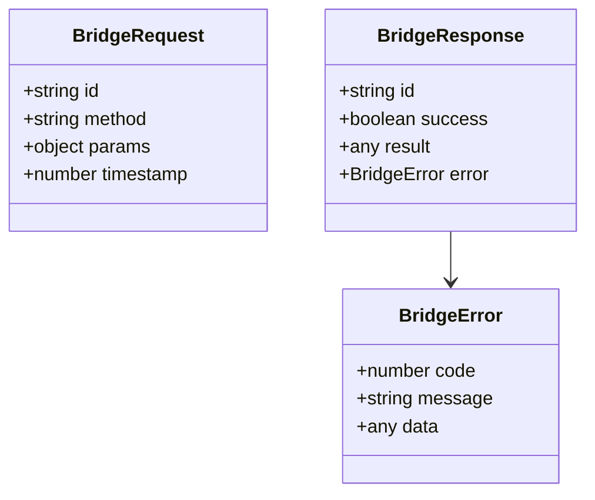
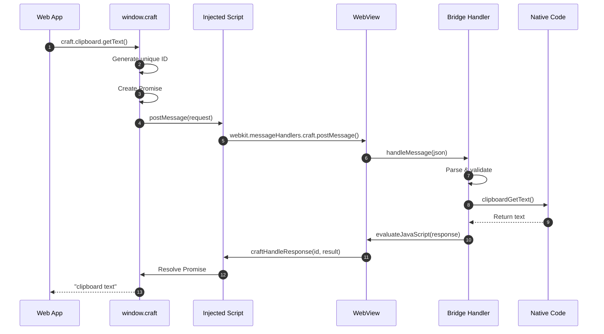
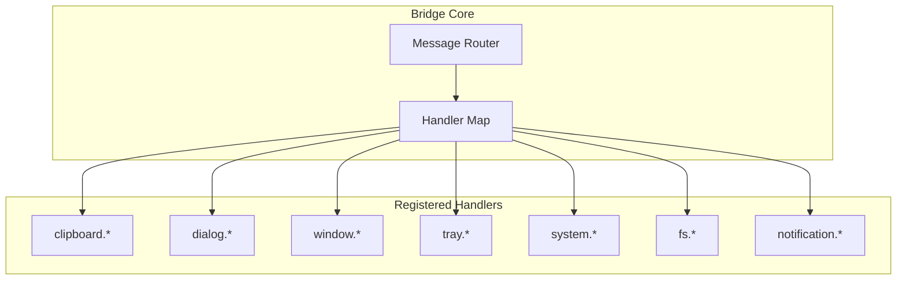
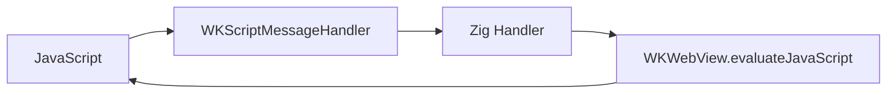
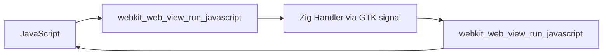
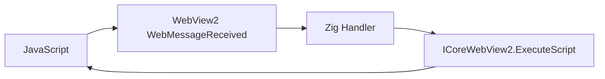
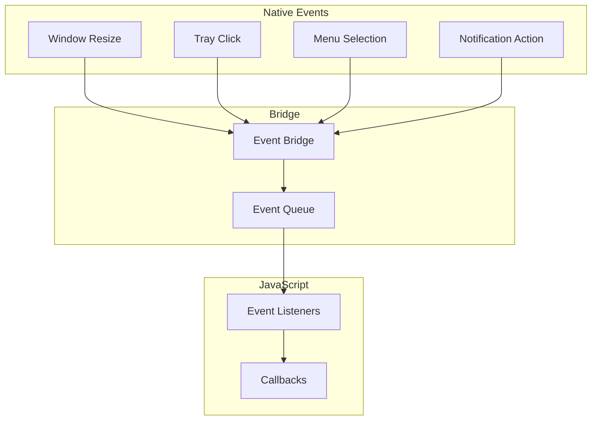
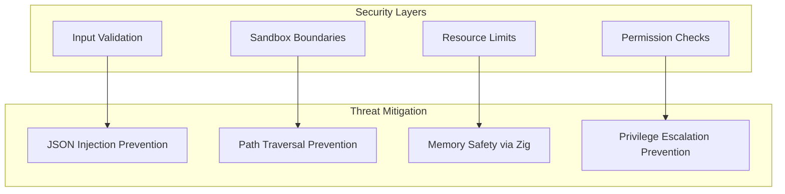
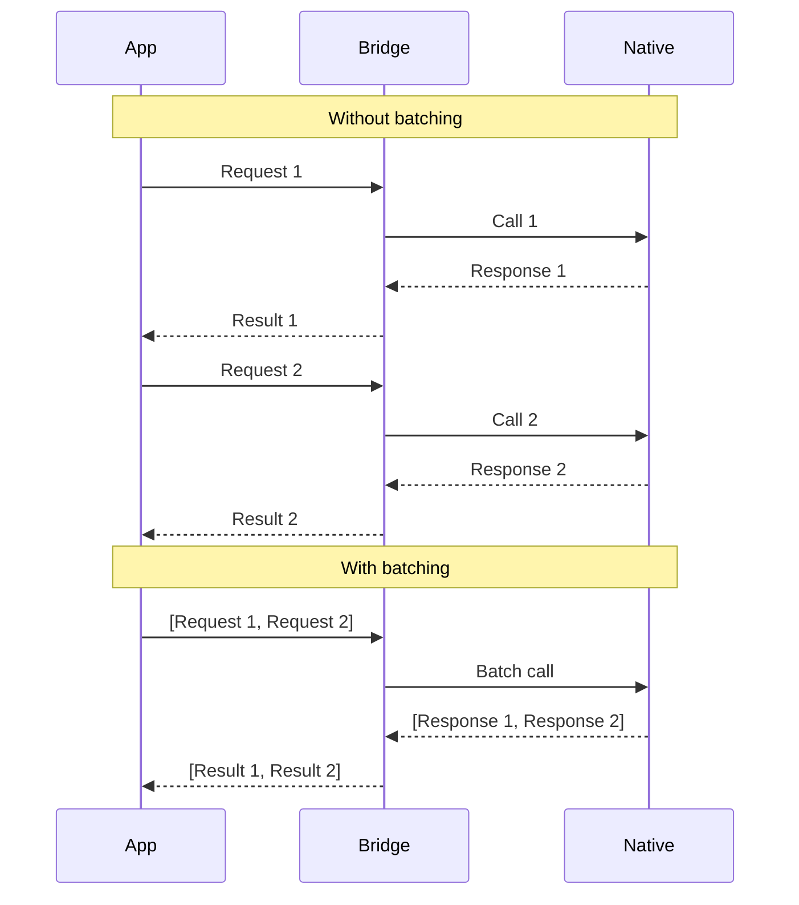

# Bridge Protocol Architecture

This document details the architecture of Craft's JavaScript-to-Zig bridge system.

## Overview

The bridge enables bidirectional communication between JavaScript running in the WebView and native Zig code. It uses a JSON-RPC-like protocol for message passing.

## Protocol Specification

### Request Format



### Message Flow



## Error Codes

| Code | Name | Description |
|------|------|-------------|
| -32700 | ParseError | Invalid JSON received |
| -32600 | InvalidRequest | Request object is invalid |
| -32601 | MethodNotFound | Method does not exist |
| -32602 | InvalidParams | Invalid method parameters |
| -32603 | InternalError | Internal bridge error |
| -32000 | PlatformError | Platform-specific error |
| -32001 | PermissionDenied | Operation not permitted |
| -32002 | NotSupported | Feature not supported on platform |

## Handler Registration



## Platform-Specific Implementation

### macOS



### Linux



### Windows



## Injected JavaScript API

The bridge injects a `window.craft` object into every WebView:

```javascript
window.craft = {
    // Core
    invoke: (method, params) => Promise,
    getPlatform: () => string,
    getVersion: () => string,

    // Namespaced APIs
    clipboard: {
        getText: () => Promise<string>,
        setText: (text) => Promise<void>,
        getImage: () => Promise<Blob>,
        setImage: (blob) => Promise<void>
    },

    dialog: {
        open: (options) => Promise<string[]>,
        save: (options) => Promise<string>,
        message: (options) => Promise<string>
    },

    window: {
        setTitle: (title) => Promise<void>,
        setSize: (width, height) => Promise<void>,
        setPosition: (x, y) => Promise<void>,
        minimize: () => Promise<void>,
        maximize: () => Promise<void>,
        close: () => Promise<void>
    },

    notification: {
        show: (options) => Promise<string>,
        requestPermission: () => Promise<string>
    },

    tray: {
        create: (options) => Promise<string>,
        setIcon: (id, icon) => Promise<void>,
        setMenu: (id, menu) => Promise<void>,
        destroy: (id) => Promise<void>
    },

    // Events
    on: (event, callback) => void,
    off: (event, callback) => void,
    once: (event, callback) => void
};
```

## Event System



### Event Message Format

```json
{
    "type": "event",
    "event": "tray:click",
    "data": {
        "id": "tray-1",
        "button": "left",
        "x": 100,
        "y": 200
    }
}
```

## Security Considerations



## Performance Optimization

### Message Batching



### Caching

- Method resolution is cached after first lookup
- Frequently used handlers maintain pre-allocated response buffers
- Platform-specific optimizations for string conversion

## Testing the Bridge

```zig
test "bridge handles clipboard getText" {
    const allocator = std.testing.allocator;

    const request = try Bridge.parseRequest(
        \\{"id":"1","method":"clipboard.getText","params":{}}
    );
    defer request.deinit();

    const response = try Bridge.handleRequest(allocator, request);
    defer allocator.free(response);

    try std.testing.expect(std.mem.indexOf(u8, response, "\"success\":true") != null);
}
```

## Further Reading

- [BRIDGE_API.md](../BRIDGE_API.md) - Full API reference
- [QUICK_REFERENCE.md](../QUICK_REFERENCE.md) - Quick reference guide
- [js_bridge.zig](../../packages/zig/src/js_bridge.zig) - Implementation
