# Component Architecture

This document describes Craft's native UI component system architecture.

## Overview

Craft provides 35+ native UI components that render using platform-native widgets rather than web-based rendering, ensuring native look, feel, and performance.

## Component Hierarchy

```mermaid
graph TB
    subgraph "Component Base"
        BC[BaseComponent]
        LC[LayoutComponent]
        IC[InteractiveComponent]
    end

    subgraph "Input Components"
        BTN[Button]
        TXT[TextInput]
        CHK[Checkbox]
        RAD[RadioButton]
        SLD[Slider]
        TOG[Toggle]
        CLR[ColorPicker]
        DTE[DatePicker]
        TME[TimePicker]
        AUT[Autocomplete]
    end

    subgraph "Display Components"
        LBL[Label]
        IMG[ImageView]
        PRG[ProgressBar]
        SPN[Spinner]
        AVT[Avatar]
        BDG[Badge]
        CHP[Chip]
        CRD[Card]
        TIP[Tooltip]
        TST[Toast]
    end

    subgraph "Layout Components"
        SCR[ScrollView]
        SPL[SplitView]
        STK[Stack]
        ACC[Accordion]
        STP[Stepper]
        MOD[Modal]
        TAB[Tabs]
        DRP[Dropdown]
    end

    subgraph "Data Components"
        LST[ListView]
        TBL[Table]
        TRE[TreeView]
        DGR[DataGrid]
        CHT[Chart]
    end

    subgraph "Advanced Components"
        RAT[Rating]
        CDE[CodeEditor]
        MDP[MediaPlayer]
    end

    BC --> IC
    BC --> LC

    IC --> BTN
    IC --> TXT
    IC --> CHK
    IC --> RAD
    IC --> SLD
    IC --> TOG
    IC --> CLR
    IC --> DTE
    IC --> TME
    IC --> AUT

    BC --> LBL
    BC --> IMG
    BC --> PRG
    BC --> SPN
    BC --> AVT
    BC --> BDG
    BC --> CHP
    BC --> CRD
    IC --> TIP
    BC --> TST

    LC --> SCR
    LC --> SPL
    LC --> STK
    LC --> ACC
    IC --> STP
    LC --> MOD
    IC --> TAB
    IC --> DRP

    LC --> LST
    LC --> TBL
    LC --> TRE
    LC --> DGR
    LC --> CHT

    IC --> RAT
    IC --> CDE
    IC --> MDP
```

## Component Lifecycle

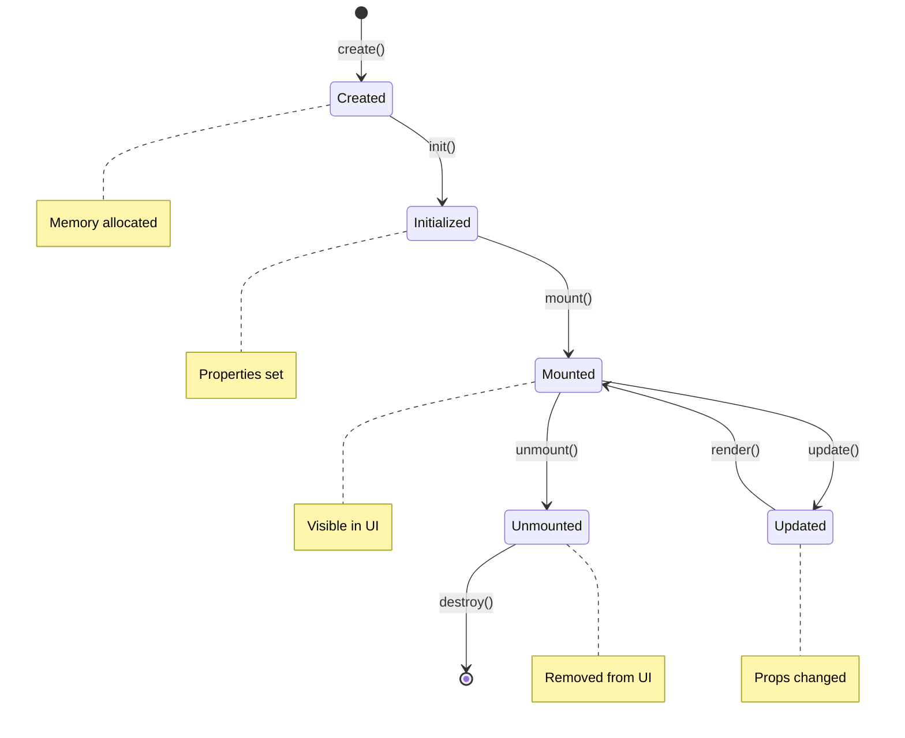

## Platform Widget Mapping

### Button Component

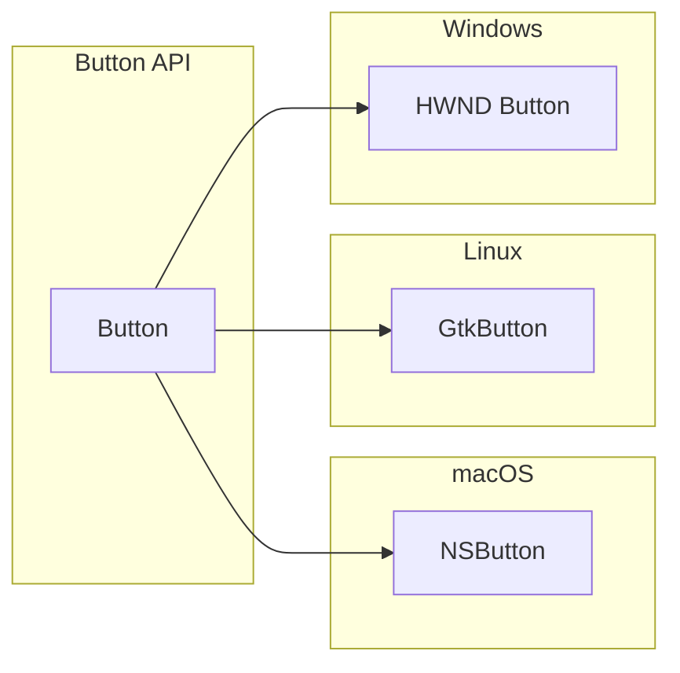

### Text Input Component

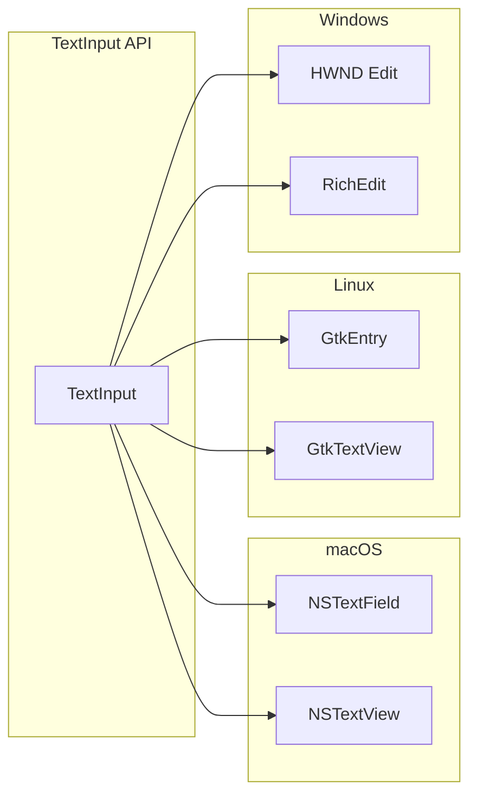

## Component Properties

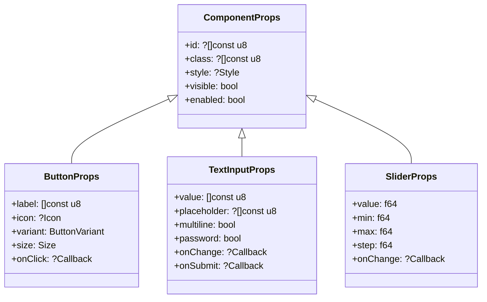

## Event System

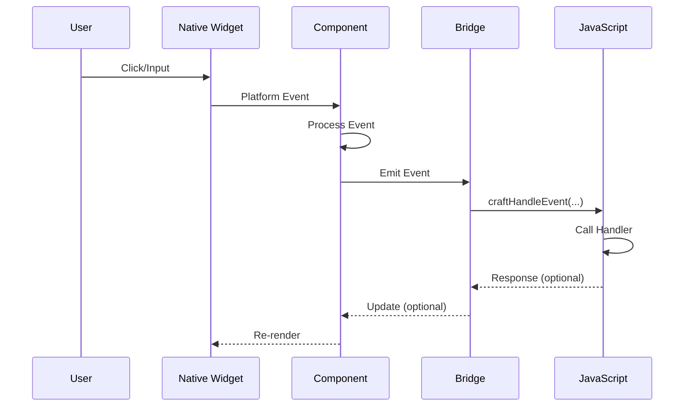

### Event Types

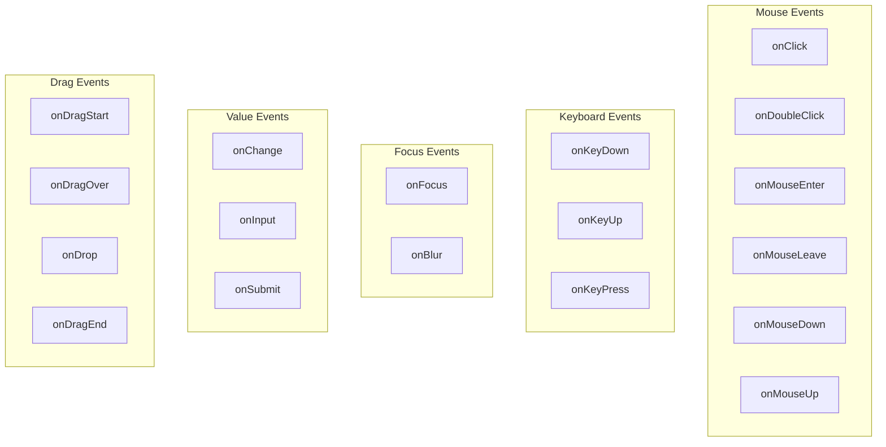

## Styling System

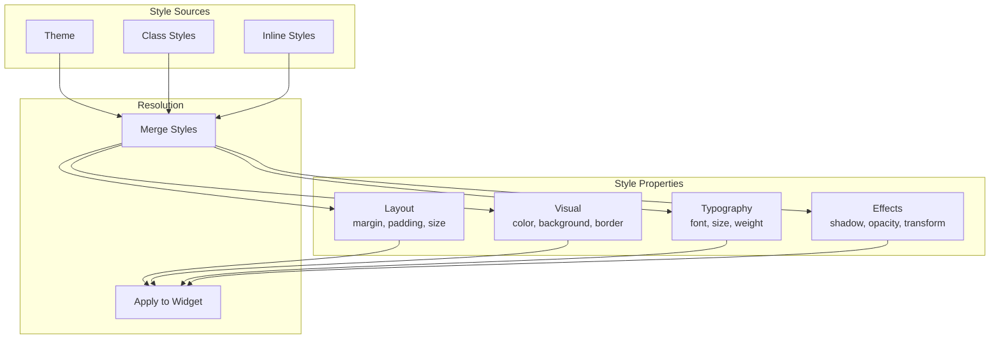

## Layout System

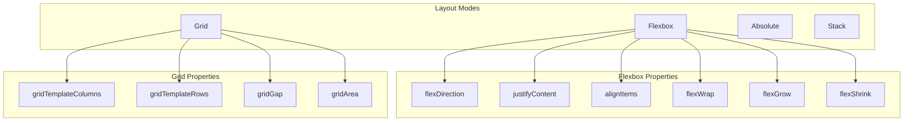

## Accessibility

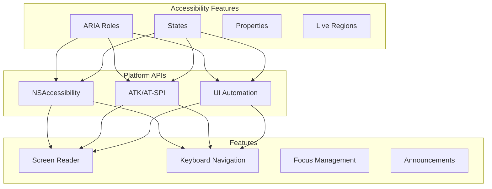

### ARIA Role Mapping

| Component | ARIA Role | macOS | GTK | Windows |
|-----------|-----------|-------|-----|---------|
| Button | button | AXButton | GTK_ROLE_BUTTON | UIA_ButtonControlTypeId |
| Checkbox | checkbox | AXCheckBox | GTK_ROLE_CHECK_BOX | UIA_CheckBoxControlTypeId |
| TextInput | textbox | AXTextField | GTK_ROLE_ENTRY | UIA_EditControlTypeId |
| Slider | slider | AXSlider | GTK_ROLE_SLIDER | UIA_SliderControlTypeId |
| Tabs | tablist | AXTabGroup | GTK_ROLE_TAB_GROUP | UIA_TabControlTypeId |
| Modal | dialog | AXSheet | GTK_ROLE_DIALOG | UIA_WindowControlTypeId |

## Component Implementation Pattern

```zig
pub const Button = struct {
    base: BaseComponent,
    props: ButtonProps,
    native_handle: ?*anyopaque,

    pub fn create(allocator: Allocator, props: ButtonProps) !*Button {
        const self = try allocator.create(Button);
        self.* = .{
            .base = BaseComponent.init(allocator),
            .props = props,
            .native_handle = null,
        };
        return self;
    }

    pub fn mount(self: *Button, parent: *anyopaque) !void {
        self.native_handle = switch (builtin.os.tag) {
            .macos => try self.createNSButton(parent),
            .linux => try self.createGtkButton(parent),
            .windows => try self.createWin32Button(parent),
            else => return error.UnsupportedPlatform,
        };
        self.base.state = .mounted;
    }

    pub fn update(self: *Button, new_props: ButtonProps) !void {
        if (!std.mem.eql(u8, self.props.label, new_props.label)) {
            try self.setLabel(new_props.label);
        }
        self.props = new_props;
    }

    pub fn unmount(self: *Button) void {
        if (self.native_handle) |handle| {
            self.destroyNativeWidget(handle);
            self.native_handle = null;
        }
        self.base.state = .unmounted;
    }

    pub fn destroy(self: *Button, allocator: Allocator) void {
        self.unmount();
        allocator.destroy(self);
    }
};
```

## Theme System

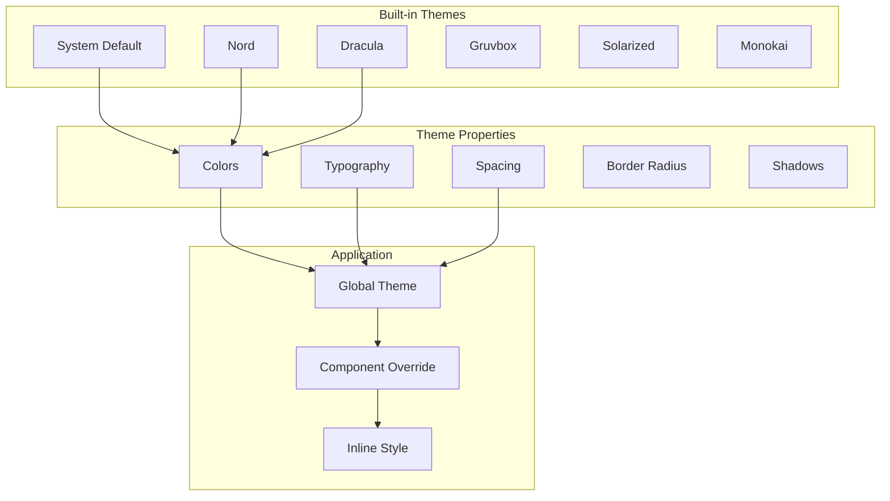

## Complex Component: DataGrid

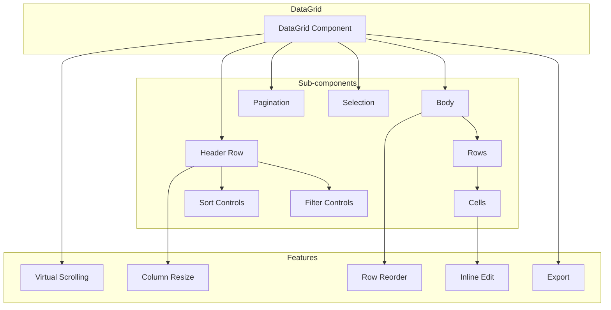

## Further Reading

- [components.zig](../../packages/zig/src/components.zig) - Component manager
- [components/](../../packages/zig/src/components/) - Individual components
- [accessibility.zig](../../packages/zig/src/accessibility.zig) - Accessibility system
- [theme.zig](../../packages/zig/src/theme.zig) - Theme system
