# Mobile Architecture

This document describes Craft's mobile platform architecture for iOS and Android.

## Overview

Craft provides a unified mobile API through `mobile.zig` that abstracts iOS and Android platform differences while exposing platform-specific features when needed.

## Platform Abstraction

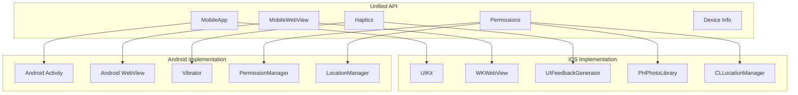

## iOS Architecture

### Application Lifecycle

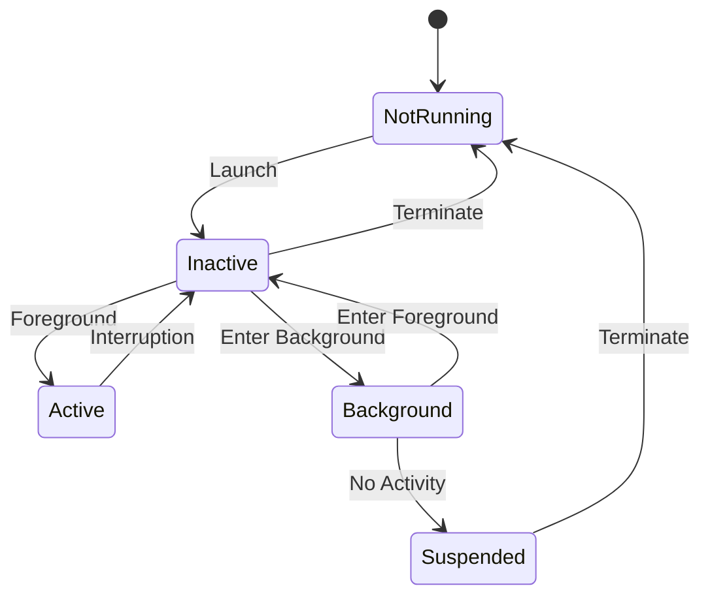

### WKWebView Integration

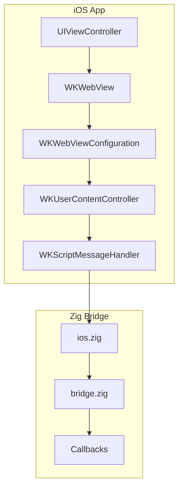

### iOS-Specific Features

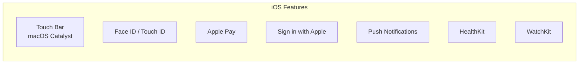

## Android Architecture

### Activity Lifecycle

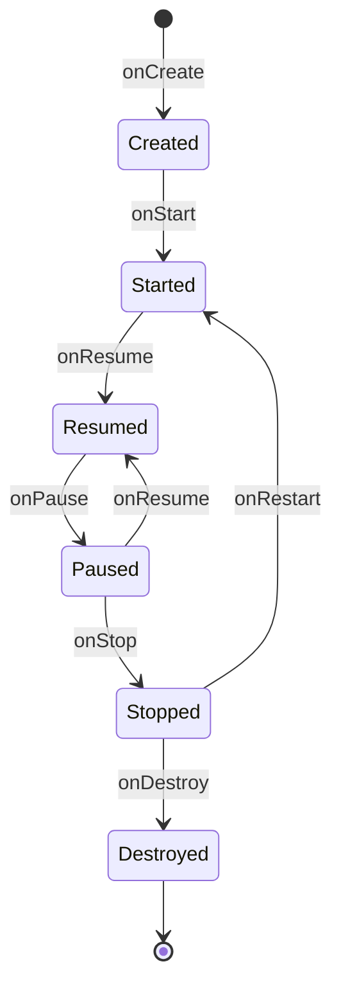

### WebView Integration

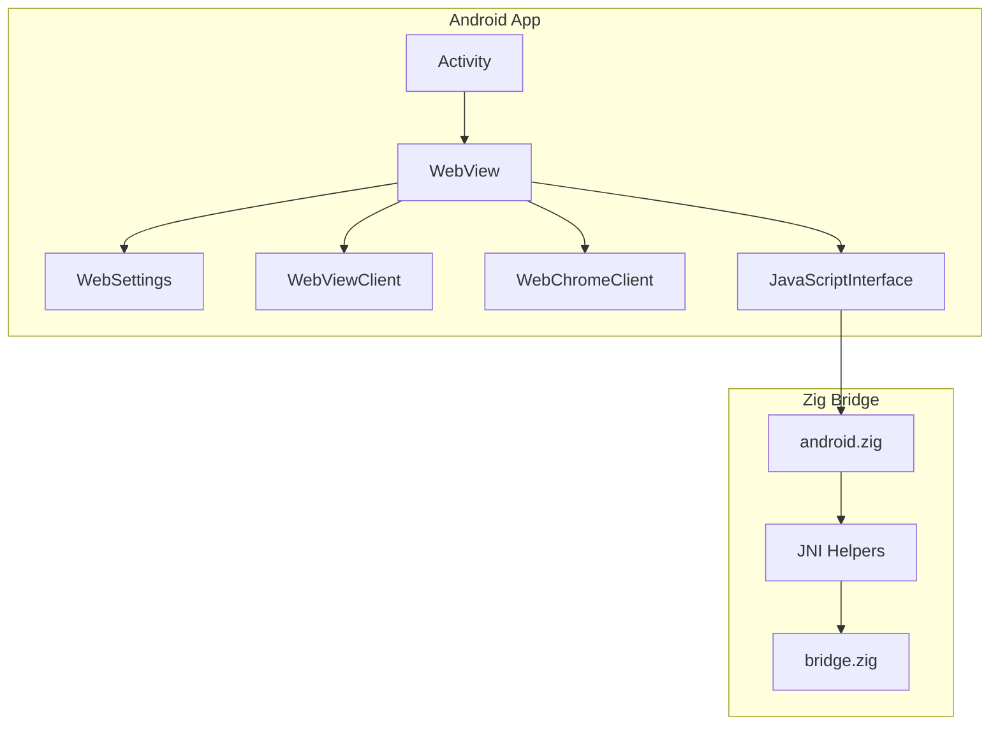

### Android-Specific Features

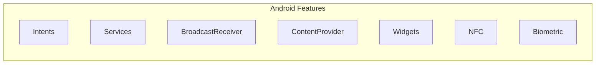

## Permission System

### iOS Permissions

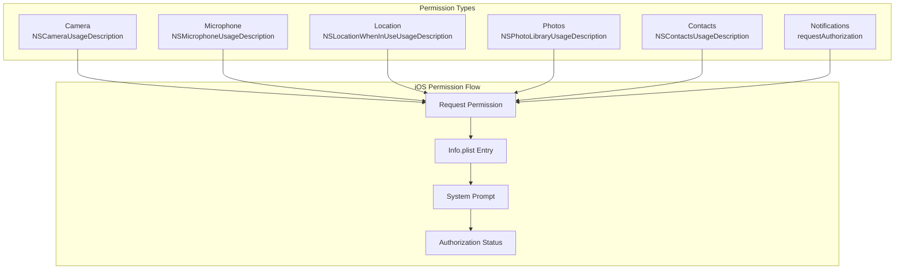

### Android Permissions

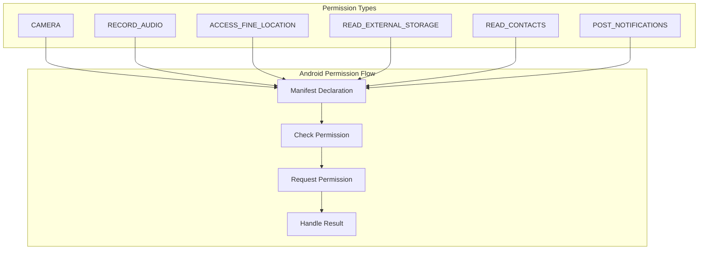

## Unified Permission API

```zig
pub const Permission = enum {
    camera,
    microphone,
    location,
    location_always,
    photos,
    contacts,
    notifications,
    calendar,
    reminders,
    bluetooth,
};

pub const PermissionStatus = enum {
    not_determined,
    restricted,
    denied,
    authorized,
    limited,
};

pub fn requestPermission(permission: Permission) !PermissionStatus {
    // Platform-specific implementation
}
```

## Haptic Feedback

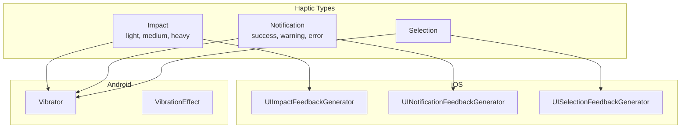

## Bridge Protocol (Mobile)

### iOS Message Handler

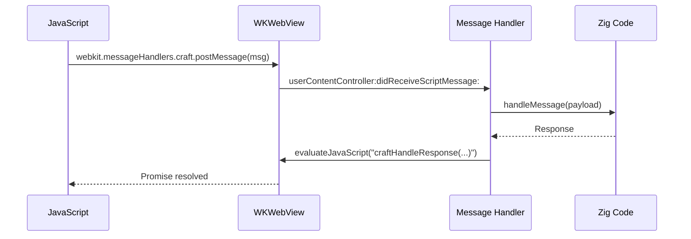

### Android JavaScript Interface

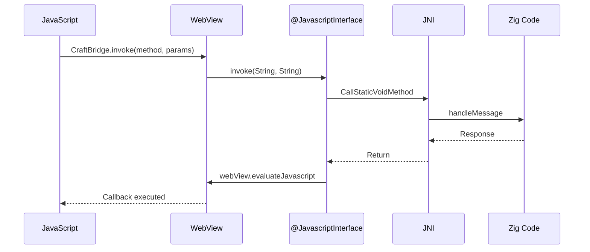

## Native Object Management

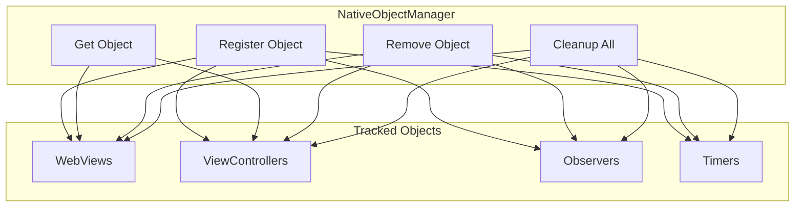

## Build Configuration

### iOS Targets

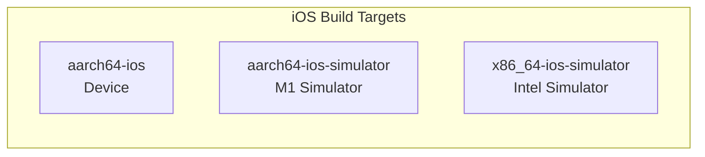

### Android Targets

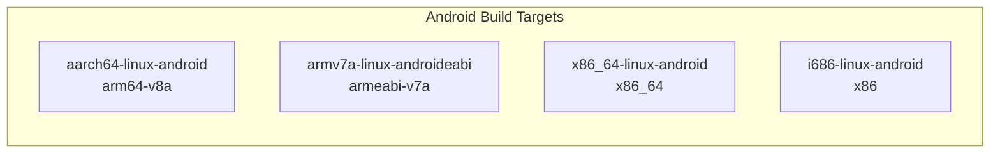

## Project Templates

### iOS Template Structure

```
MyApp/
├── MyApp.xcodeproj/
├── MyApp/
│   ├── AppDelegate.swift
│   ├── SceneDelegate.swift
│   ├── ViewController.swift
│   ├── Info.plist
│   └── Assets.xcassets/
├── Frameworks/
│   └── libcraft.a
└── web/
    └── index.html
```

### Android Template Structure

```
MyApp/
├── app/
│   ├── build.gradle
│   ├── src/main/
│   │   ├── java/com/myapp/
│   │   │   └── MainActivity.java
│   │   ├── jniLibs/
│   │   │   ├── arm64-v8a/
│   │   │   └── x86_64/
│   │   ├── res/
│   │   └── AndroidManifest.xml
│   └── src/main/assets/
│       └── web/
│           └── index.html
├── build.gradle
└── settings.gradle
```

## Further Reading

- [mobile.zig](../../packages/zig/src/mobile.zig) - Mobile implementation
- [PLATFORM_SUPPORT.md](../../packages/zig/PLATFORM_SUPPORT.md) - Platform feature matrix
- [ios_template.zig](../../packages/zig/src/ios_template.zig) - iOS project template
- [android_template.zig](../../packages/zig/src/android_template.zig) - Android project template
